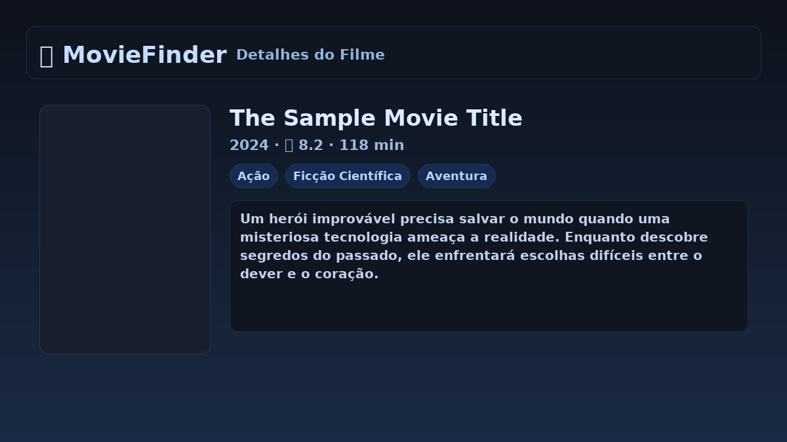
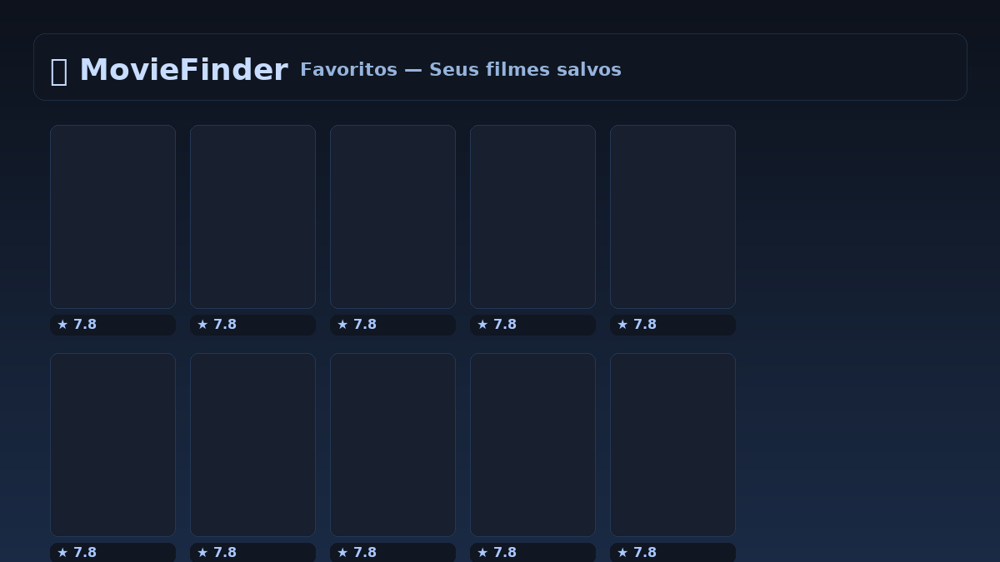

# 🎬 MovieFinder

Aplicação web para descobrir, buscar e favoritar filmes.  
Desenvolvida com **React + TypeScript + Redux Toolkit + Vite**.


---

## ✨ Funcionalidades
- 🔍 **Busca** de filmes com debounce e paginação  
- 🎭 **Filtro por gênero**  
- 📖 **Detalhes** do filme (nota, sinopse, gêneros, duração)  
- ⭐ **Favoritos** com persistência em `localStorage`  
- ⏳ **Skeletons** de carregamento e estados de vazio/erro  
- ♿ **Acessibilidade básica** (foco visível, aria-labels, skip link)  
- ✅ **Testes unitários** com Vitest + Testing Library  

---

## 🚀 Tecnologias
- [React 18](https://react.dev/)  
- [TypeScript](https://www.typescriptlang.org/)  
- [Redux Toolkit](https://redux-toolkit.js.org/)  
- [React Router](https://reactrouter.com/)  
- [Vite](https://vitejs.dev/)  
- [Vitest](https://vitest.dev/) + [Testing Library](https://testing-library.com/)  

---

## 🔧 Como rodar localmente

```bash
# 1. Instalar dependências
npm install

# 2. Criar arquivo .env na raiz com sua chave da TMDB
echo "VITE_TMDB_API_KEY=SUA_CHAVE_TMDB" > .env

# 3. Rodar em modo dev
npm run dev

# 4. Rodar testes
npm test

## 📸 Screenshots

<p align="center">
  
  
  
</p>
